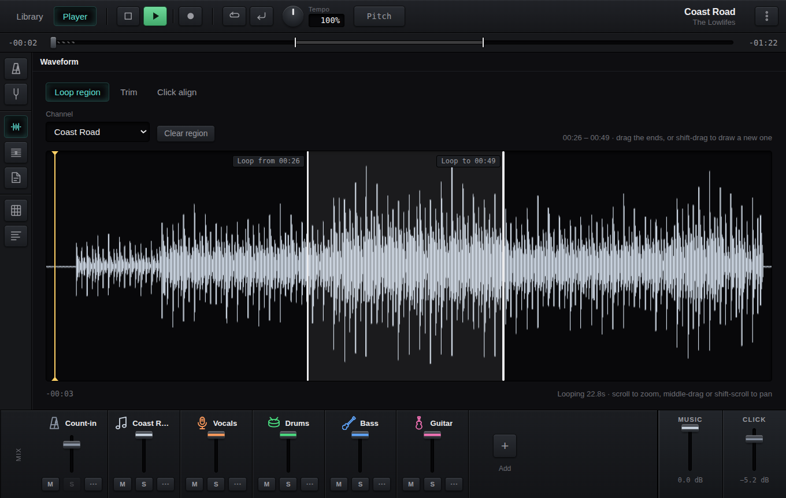
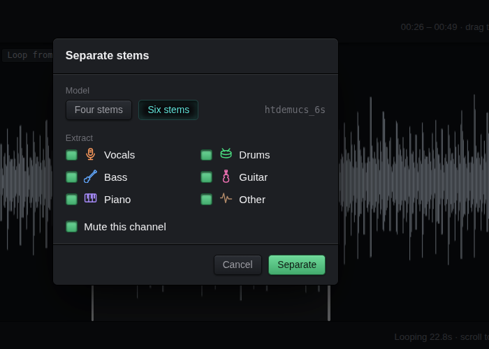
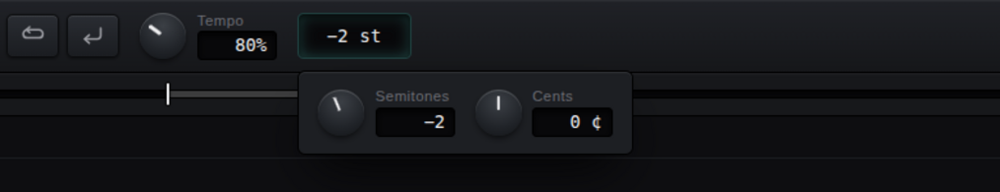
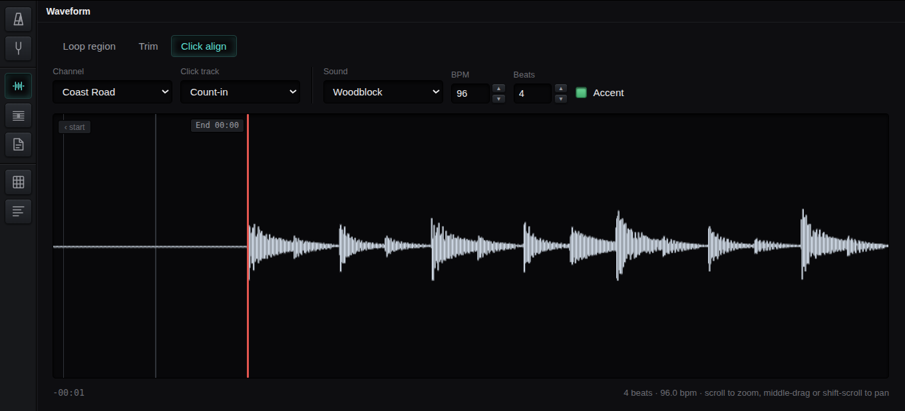
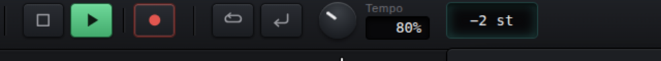
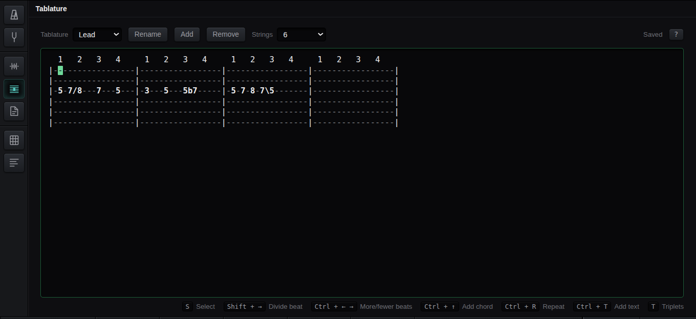
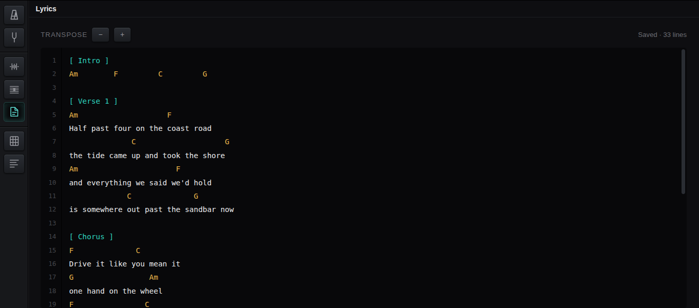
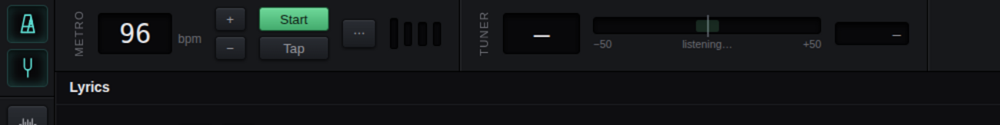
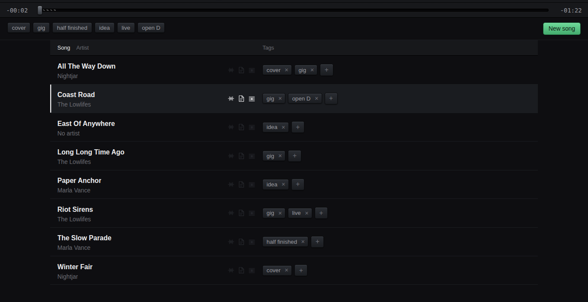

# Rehearsal Space

**Learn the song. Then write your own.**

A desktop practice room: pull a recording apart, slow it down without it going
flat, count yourself in, record what you played over the top, and write the
words and the tab beside it. One window, one song, everything to hand.

It is not a DAW. There is no mixdown, no plugin chain, no automation lane — the
things you reach for with a guitar already on.



---

## Take a song apart

Drop in an MP3, or paste a YouTube link and let it fetch the audio. Then split
it into its instruments — vocals, drums, bass, guitar, piano — each arriving as
its own channel with its own fader, mute and solo.

Learning the bass line? Solo the bass. Singing it? Mute the vocal and keep the
band. The separation runs on your own machine; nothing is uploaded anywhere.



## Slow it down. Move it into your key.

Tempo and pitch are separate knobs and neither touches the other. Take it to
80% to learn the fast part and it stays in tune. Drop it two semitones to sing
it comfortably and it stays at speed. Both at once works exactly as you'd hope.



Mark a region and it loops until you have it.

## Count yourself in

Add a click track and line it up against the music by eye. Drag its end to
where the band comes in and the clicks fall *before* it — into negative time if
the count-in needs it. The tempo is nudged to whatever divides the span evenly,
so the last beat finishes exactly where the music starts, rather than drifting
off it a bar later.



Pick the sound — woodblock, claves, hi-hat, cross-stick, kick — and how many
beats to a bar.

## Record yourself over it



Arm the record button and it captures for exactly as long as the player runs,
so the take lands in time with the song rather than wherever you managed to hit
two buttons. Recorded a harmony over the second chorus? It sits at the second
chorus.

An interface with two sockets arrives as one stereo device, so you choose the
socket and the take comes in mono — a guitar in the first and a mic in the
second are two performances, not the left and right of one. Everything the
browser offers to help a phone call is refused: echo cancellation and noise
suppression exist to make speech intelligible by altering it.

## Write the tab

A tablature editor you drive entirely from the keyboard. Type frets, and it
lays out the bars, moves the beat markers and widens the columns as you go.
Slides, hammer-ons, bends, palm mutes, vibrato, triplets, repeats, sixteenths
and thirty-seconds — as much as text tab can carry and no more.



It is plain text, in the format everyone already pastes into forum posts, so it
copies in and out of anywhere. A song can hold several — lead, rhythm, bass,
the vocal melody.

## Write the words

Chords over the lines, sections in brackets, notes to yourself in parentheses,
and a dash for a line you haven't settled yet. Transpose the whole song a
semitone at a time and every chord moves with it, spelled the way people write
it — E♭ rather than D♯.



Plain text again. It is your file; take it wherever you like.

## And the small things

A metronome you can tap a tempo into, and a tuner listening to the same input
you record from. Both a keypress away, both out of the way when you're done.
There's a rhyme finder and a chord chart for the key you're in, too.



## Your songs are files

One folder per song, named after the song. The audio inside it is named after
the channel, so the take called "Rhythm" is `Rhythm.ogg` — drag it into your DAW
later and it is still called what you called it. Lyrics and tab are text.

```
Coast Road/
  song.json
  audio/Rhythm.ogg
  lyrics.txt
  tabs/Lead.txt
```

Nothing is in a cloud. Nothing needs an account. Back it up by copying a folder.



---

## Getting it

Grab the file for your machine from
[Releases](../../releases) — an AppImage or `.deb` for Linux, a `.dmg` for
macOS, an installer or a zip for Windows.

Nothing is signed with a paid certificate yet, so macOS asks you to open it from
the context menu the first time and Windows shows a SmartScreen warning until
the download earns a reputation. Each release explains how to get past both.

Linux is where it is built and used daily; macOS and Windows are built by the
same pipeline and are newer ground.

`ffmpeg`, `ffprobe` and `yt-dlp` fetch themselves on first run. Stem separation
needs `demucs`, which is about a gigabyte — so it is never installed behind your
back. Ask for stems and the app offers, tells you what it costs, and will remove
it again later.

## Building it

```sh
npm install
npm run dev
```

[DEV.md](DEV.md) has the rest: packaging, releases, the audio graph and how the
external tools are handled.
